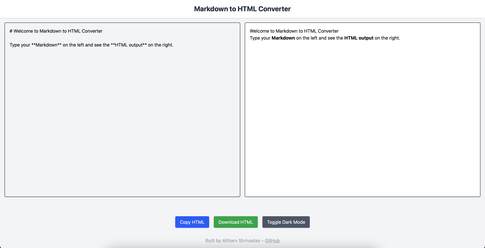

# 📝 Markdown to HTML Converter

A sleek, professional Markdown editor and HTML converter built with **React**, **TailwindCSS**. Write Markdown and see real-time HTML output, and export the result with ease.

 <!-- Add a screenshot here if possible -->

## ✨ Features

- ⚡️ Real-time Markdown to HTML conversion
- 📋 Copy generated HTML to clipboard
- 📥 Download HTML as a standalone file
- 🧼 Sanitized output using DOMPurify
- 💅 Fully responsive and beautifully themed with Tailwind CSS

## 🚀 Live Demo

🔗 [Try it live here](https://markdown-html-converter-ten.vercel.app)

## 📦 Tech Stack

- **Frontend**: React, Tailwind CSS, Milkdown
- **Markdown Parsing**: `marked.js`
- **Security**: `DOMPurify` to sanitize output
- **Deployment**: Vercel 

## 📂 Future Scope:

- Allow users to import `.md` files
- Use and md editor for users to see (WYSIWYG)
- Better styling
- CSS for styling markdown better on people's defined font sizing.

